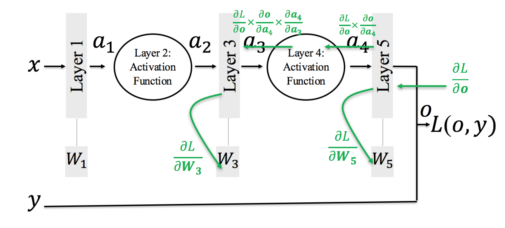

# Understanding Deep Neural Nets

This is the report for ET 803 (Advanced Topic for Cognition) course project.

## Introduction
One of the paper which I presented was Computer Vision and Computer Hallucinations [^1] by Brian Hayes. In the paper the author compiles the recent developments made in deep neaural nets for image recognition and computer vision. The authors are trying to understand what is learnt by a neural network when it is trained. So they try see things in reverse order, i.e. given an object what is the image that comes to your mind. Or in other words, what should be the optimum input to the neural network so that the probability of image being classified as a particular class is maximised. This idea is taken from the paper by Karen Simonyan, Andrea Vedaldi and Andrew Zisserman named - Deep Inside Convolutional Networks: Visualising Image Classification Models and Saliency Maps [^2]

So we will try to understand Neural Networks through real-world visualisations. Firstly, lets overview how neural networks are trained.

## How Neural Networks Work
### Backpropagation

We define a Loss function for the ouput of a neural network as *L(o,y)* where o is predicted output, and y is the expected output.
After initializing weights with small random values. We train the network for many iterations. Each iteration invlovles 3 steps:

1. Forward: To find output from input and weights.
2. Backward: To find how *dL/do* and use it to find *dL/dWi* for each layer i.
3. Update: `W = W - lr * dL/dWi`, where lr is the learning rate.

## Modified Backpropogation
### Methodology to find best input image for a particular class

In original backpropopagation we start with `dL/do` and where `o` is the last layer. We can also call `o` as `On` (it means output of **n**th Layer). Similarly, lets use `In` for the input of **i**th Layer and `Wn` for weights of **i**th Layer. Now we are interested to find `dL/dWi` for each **i** between **1** to **n**. We calculate `dL/dWn` from `dL/do` (i.e. `dL/dOn`) and `In`. Similarly we can calculate `dL/dWn-1` from `dL/dOn-1` (i.e. `dL/dIn`) and `Wn-1`. But we dont know `dL/dIn` which can be calculated from `dL/dOn` and `Wn`. We already remember `Wn`, `Wn-1` .. etc and `In`, `In-1` .. etc from forward propagation.

In Modifed Backpropagation the first two steps of iterations are same. In the 3rd step we already have `dL/dI1` from step 2 and instead of updating weights, we update the input image as follows

`I = I - lr * dL/dI`, here `dL/dI` is used for `dL/dI1` and lr is learning rate.

Note that we take mean of all the training images to get initial value of `I`.

##Data

[^1]: [Computer Vision and Computer Hallucinations][1]
[^2]: [Deep Inside Convolutional Networks: Visualising Image Classification Models and Saliency Maps][2]
[1]: http://example.com/ "Title"
[2]: http://example.org/ "Title"