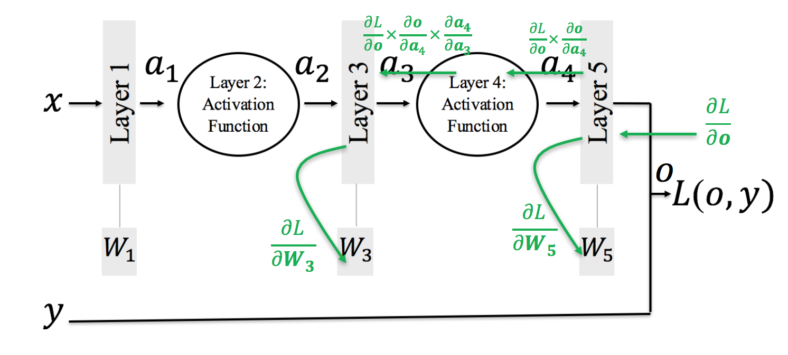
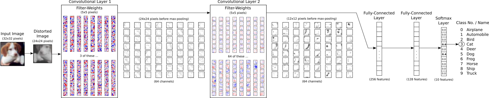
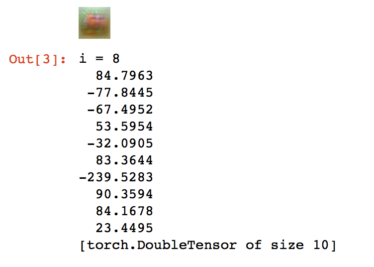

# Understanding Deep Neural Nets

This is the report for ET 803 (Advanced Topic for Cognition) course project.

## Introduction
One of the paper which I presented during the course was [Computer Vision and Computer Hallucinations] (^1) by Brian Hayes. In the paper the author compiles the recent developments made in deep neaural nets for image recognition and computer vision. The authors are trying to understand what is learnt by a neural network when it is trained. So they try see things in reverse order, i.e. given an object what is the image that comes to your mind. Or in other words, what should be the optimum input to the neural network so that the probability of image being classified as a particular class is maximised. This idea is taken from the paper by Karen Simonyan, Andrea Vedaldi and Andrew Zisserman named - [Deep Inside Convolutional Networks: Visualising Image Classification Models and Saliency Maps] (^2)

So we will try to understand Neural Networks through real-world visualisations. Firstly, lets overview how neural networks are trained.

## How Neural Networks Work
### Backpropagation

We define a Loss function for the ouput of a neural network as *L(o,y)* where o is predicted output, and y is the expected output.
After initializing weights with small random values. We train the network for many iterations. Each iteration invlovles 3 steps:

1. Forward: To find output from input and weights.
2. Backward: To find how *dL/do* and use it to find *dL/dWi* for each layer i.
3. Update: `W = W - lr * dL/dWi`, where lr is the learning rate.

## Modified Backpropogation
### Methodology to find best input image for a particular class

In original backpropopagation we start with `dL/do` and where `o` is the last layer. We can also call `o` as `On` (it means output of **n**th Layer). Similarly, lets use `In` for the input of **i**th Layer and `Wn` for weights of **i**th Layer. Now we are interested to find `dL/dWi` for each **i** between **1** to **n**. We calculate `dL/dWn` from `dL/do` (i.e. `dL/dOn`) and `In`. Similarly we can calculate `dL/dWn-1` from `dL/dOn-1` (i.e. `dL/dIn`) and `Wn-1`. But we dont know `dL/dIn` which can be calculated from `dL/dOn` and `Wn`. We already remember `Wn`, `Wn-1` .. etc and `In`, `In-1` .. etc from forward propagation.

In Modifed Backpropagation the first two steps of iterations are same. In the 3rd step we already have `dL/dI1` from step 2 and instead of updating weights, we update the input image as follows

`I = I - lr * dL/dI`, here `dL/dI` is used for `dL/dI1` and lr is learning rate.

Note that we take mean of all the training images to initialize the value of `I`.

## Data

The CIFAR-10 dataset consists of 60000 32x32 colour images in 10 classes, with 6000 images per class. There are 50000 training images and 10000 test images.

Training Phase:

Below is an illustrative diagramatic representation of inner layers neural network. I am not using this network. I am training on a similar but simpler network.

### Neuaral Network Structure 

## Observations

How difficult is to classify images for a neural network?

As we can see that when we optimise the image for class '8', maximum score that we achieve is 90. At the same time, class '1', '6' and '9' also have high scores around 84. So, every prediction made is not absolute cognition, but it is a relative guess.

Confusion Matrix:

	[775  20  71   8  14   4  18  10  44  36] 1 airplane
	[  7 914   5   0   3   7   9   3  14  38] 2 automobile
	[ 32   2 724  28  42  44  94  17   9   8] 3 bird
	[ 18   7  48 508  56 209  99  29   7  19] 4 cat
	[  4   2  45  25 769  29  75  43   3   5] 5 deer
	[  8   6  34  89  35 748  38  32   1   9] 6 dog
	[  4   2  18   9  14  14 930   4   2   3] 7 frog
	[  6   2  23  18  31  55  17 833   0  15] 8 horse
	[ 31  29  15  11   8   7  15   0 856  28] 9 ship
	[ 13  67   4   5   0   4   7   7  18 875] 10 truck
	 (1) (2) (3) (4) (5) (6) (7) (8) (9) (10)
	 
We can see that the Confusion Matrix is not symmetric. This implies that the training is biased towards some classes. And we cannot control it.

## Instructions to learn

To install torch7

	git clone https://github.com/torch/distro.git ~/torch --recursive
	cd ~/torch; bash install-deps;
	./install.sh
	
### To Train

You should have the directory structure of the root folder as follows

- cifar10
- - te_data.bin
- - tr_data.bin
- - tr_labels.bin
- Final.ipynb
- Readme.md
- Train.ipynb

To download the cifar10 data use this
[link](https://www.cs.toronto.edu/~kriz/cifar-10-binary.tar.gz).

cd to Project root directory and open ipython notebook in browser by using the command `ipython notebook`

Now execute all the blocks in Train.ipynb

The last block will save a neural network in a binary file in the same folder by name ttt.t7

### To perform experiments on trained network

Now execute all the blocks in Final.ipynb to see the results of our experiments.